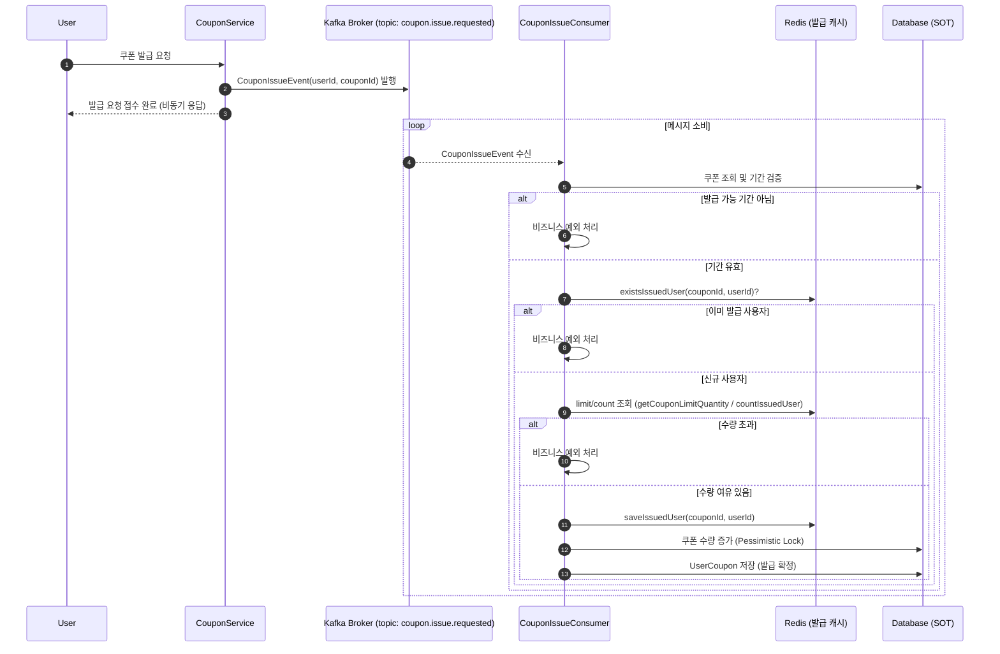

## 1. 포인트
### 1-1. 포인트 충전

### 1-2. 포인트 조회

## 2. 쿠폰
### 2-1-1. 선착순 발급 (초기 설계:동기 처리)

### 2-1-2 선착순 발급 (Redis 대기열)

### 2-1-3. 선착순 발급 (Redis + Kafka)

### 2-2. 보유 쿠폰 목록 조회

## 3. 상품
### 3-1. 상품 조회

### 3-2-1. 상위 상품 (초기 설계 : 스케줄러로 테이블 업데이트)

### 3-2-2. 상위 상품(Redis 캐싱, Application Event)

### 3-2-3. 상위 상품 조회 (Kafka 이벤트)

## 4. 주문/결제
### 4-1. 주문/결제 (초기 설계)

### 4-2. 주문 완료 이후 Outbox + Kafka

