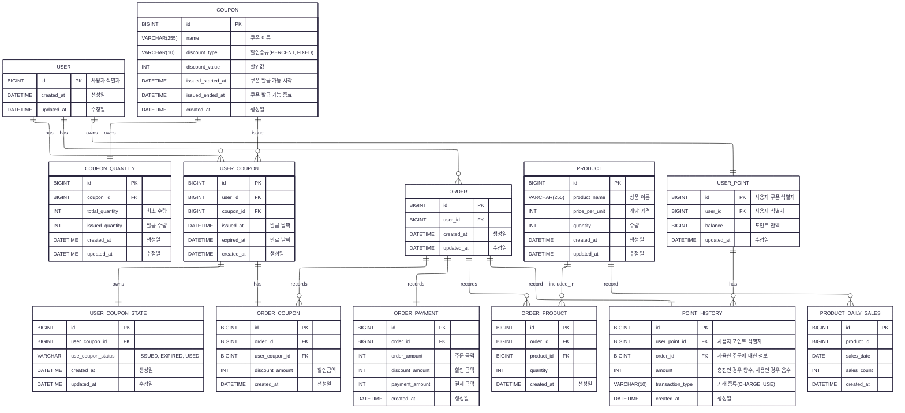

```mermaid
---
config:
  theme: redux
  layout: elk
---
erDiagram
    USER {
        BIGINT id PK "사용자 식별자"
        DATETIME created_at "생성일"
        DATETIME updated_at "수정일"
    }
    
    COUPON {
        BIGINT id PK
        VARCHAR(255) name "쿠폰 이름"
        VARCHAR(10) discount_type "할인종류(PERCENT, FIXED)"
        INT discount_value "할인값"
        DATETIME issued_started_at "쿠폰 발급 가능 시작"
        DATETIME issued_ended_at  "쿠폰 발급 가능 종료"
        DATETIME created_at "생성일"
    }
    
    COUPON ||--|| COUPON_QUANTITY : owns
    COUPON_QUANTITY {
        BIGINT id PK
        BIGINT coupon_id FK
        INT totlal_quantity "최초 수량"
        INT issued_quantity "발급 수량"
        DATETIME created_at "생성일"
        DATETIME updated_at "수정일"
    }
    
    COUPON ||--o{ USER_COUPON : issue
    USER ||--o{ USER_COUPON: has
    USER_COUPON {
        BIGINT id PK
        BIGINT user_id FK
        BIGINT coupon_id FK
        DATETIME issued_at "발급 날짜"
        DATETIME expired_at "만료 날짜"        
        DATETIME created_at "생성일"
    }
    
    USER_COUPON ||--|| USER_COUPON_STATE : owns
    USER_COUPON_STATE {
	    BIGINT id PK
	    BIGINT user_coupon_id FK
	    VARCHAR use_coupon_status "ISSUED, EXPIRED, USED"
	    DATETIME created_at "생성일"
	    DATETIME updated_at "수정일"
    }
   
    USER ||--o{ ORDER: has
    ORDER {
        BIGINT id PK
        BIGINT user_id FK
        DATETIME created_at "생성일"
        DATETIME updated_at "수정일"
    }
    
    ORDER ||--o{ ORDER_COUPON : records
    USER_COUPON ||--|| ORDER_COUPON : has
    ORDER_COUPON {
	    BIGINT id PK
	    BIGINT order_id FK
	    BIGINT user_coupon_id FK
	    INT discount_amount "할인금액"
			DATETIME created_at "생성일"
    }
    
    ORDER ||--|| ORDER_PAYMENT : records
    ORDER_PAYMENT {
        BIGINT id PK
        BIGINT order_id FK
        INT order_amount "주문 금액"
        INT discount_amount "할인 금액"
        INT payment_amount "결제 금액"
        DATETIME created_at "생성일"
    }
    
    ORDER ||--o{ ORDER_PRODUCT : records
		PRODUCT ||--o{ ORDER_PRODUCT : included_in
    ORDER_PRODUCT {
        BIGINT id PK
        BIGINT order_id FK
        BIGINT product_id FK
        INT quantity
        DATETIME created_at "생성일"
    }
    
    USER ||--|| USER_POINT : owns
    USER_POINT {
        BIGINT id PK "사용자 쿠폰 식별자"
        BIGINT user_id FK "사용자 식별자"
        BIGINT balance "포인트 잔액"
        DATETIME updated_at "수정일"
    }
    
    USER_POINT ||--o{ POINT_HISTORY : has
    ORDER ||--|| POINT_HISTORY : record
    POINT_HISTORY {
        BIGINT id PK
        BIGINT user_point_id FK "사용자 포인트 식별자"
        BIGINT order_id FK  "사용한 주문에 대한 정보"
        INT amount "충전인 경우 양수, 사용인 경우 음수"
        VARCHAR(10) transaction_type "거래 종류(CHARGE, USE)"
        DATETIME created_at "생성일"
    }
    
		PRODUCT {
        BIGINT id PK
        VARCHAR(255) product_name "상품 이름"
        INT price_per_unit "개당 가격"
        INT quantity "수량"
        DATETIME created_at "생성일"
        DATETIME updated_at "수정일"
    }
    
    PRODUCT ||--o{ PRODUCT_DAILY_SALES : record
    PRODUCT_DAILY_SALES{
	    BIGINT id PK
	    BIGINT product_id
	    DATE sales_date
	    INT sales_count
	    DATETIME created_at
	  }
```