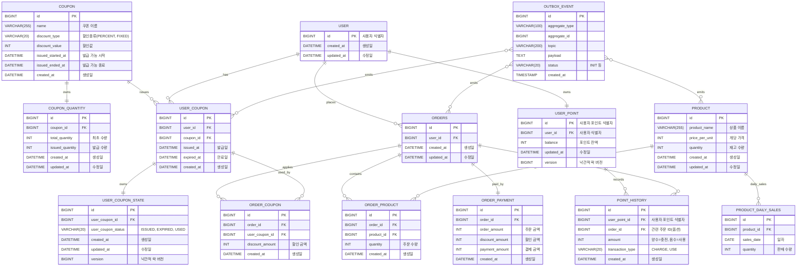

```mermaid
erDiagram
  USER {
    BIGINT id PK "사용자 식별자"
    DATETIME created_at "생성일"
    DATETIME updated_at "수정일"
  }

  COUPON {
    BIGINT id PK
    VARCHAR(255) name "쿠폰 이름"
    VARCHAR(20) discount_type "할인종류(PERCENT, FIXED)"
    INT discount_value "할인값"
    DATETIME issued_started_at "발급 가능 시작"
    DATETIME issued_ended_at  "발급 가능 종료"
    DATETIME created_at "생성일"
  }

  COUPON_QUANTITY {
    BIGINT id PK
    BIGINT coupon_id FK
    INT total_quantity "최초 수량"
    INT issued_quantity "발급 수량"
    DATETIME created_at "생성일"
    DATETIME updated_at "수정일"
  }

  USER_COUPON {
    BIGINT id PK
    BIGINT user_id FK
    BIGINT coupon_id FK
    DATETIME issued_at "발급일"
    DATETIME expired_at "만료일"
    DATETIME created_at "생성일"
  }

  USER_COUPON_STATE {
    BIGINT id PK
    BIGINT user_coupon_id FK
    VARCHAR(20) user_coupon_status "ISSUED, EXPIRED, USED"
    DATETIME created_at "생성일"
    DATETIME updated_at "수정일"
    BIGINT version "낙관적 락 버전"
  }

  USER_POINT {
    BIGINT id PK "사용자 포인트 식별자"
    BIGINT user_id FK "사용자 식별자"
    INT balance "포인트 잔액"
    DATETIME updated_at "수정일"
    BIGINT version "낙관적 락 버전"
  }

  POINT_HISTORY {
    BIGINT id PK
    BIGINT user_point_id FK "사용자 포인트 식별자"
    BIGINT order_id FK "관련 주문 ID(옵션)"
    INT amount "양수=충전, 음수=사용"
    VARCHAR(20) transaction_type "CHARGE, USE"
    DATETIME created_at "생성일"
  }

  PRODUCT {
    BIGINT id PK
    VARCHAR(255) product_name "상품 이름"
    INT price_per_unit "개당 가격"
    INT quantity "재고 수량"
    DATETIME created_at "생성일"
    DATETIME updated_at "수정일"
  }

  PRODUCT_DAILY_SALES {
    BIGINT id PK
    BIGINT product_id FK
    DATE sales_date "일자"
    INT quantity "판매 수량"
  }

  ORDERS {
    BIGINT id PK
    BIGINT user_id FK
    DATETIME created_at "생성일"
    DATETIME updated_at "수정일"
  }

  ORDER_COUPON {
    BIGINT id PK
    BIGINT order_id FK
    BIGINT user_coupon_id FK
    INT discount_amount "할인 금액"
    DATETIME created_at "생성일"
  }

  ORDER_PAYMENT {
    BIGINT id PK
    BIGINT order_id FK
    INT order_amount "주문 금액"
    INT discount_amount "할인 금액"
    INT payment_amount "결제 금액"
    DATETIME created_at "생성일"
  }

  ORDER_PRODUCT {
    BIGINT id PK
    BIGINT order_id FK
    BIGINT product_id FK
    INT quantity "주문 수량"
    DATETIME created_at "생성일"
  }

  OUTBOX_EVENT {
    BIGINT id PK
    VARCHAR(100) aggregate_type
    BIGINT aggregate_id
    VARCHAR(200) topic
    TEXT payload
    VARCHAR(20) status "INIT 등"
    TIMESTAMP created_at
  }

  %% Relationships
  COUPON ||--|| COUPON_QUANTITY : owns
  COUPON ||--o{ USER_COUPON : issues
  USER   ||--o{ USER_COUPON : has

  USER_COUPON ||--|| USER_COUPON_STATE : owns

  USER   ||--o{ ORDERS : places
  ORDERS ||--o{ ORDER_PRODUCT : contains
  PRODUCT||--o{ ORDER_PRODUCT : included_in

  ORDERS ||--o{ ORDER_COUPON : applies
  USER_COUPON ||--o{ ORDER_COUPON : used_by

  ORDERS ||--|| ORDER_PAYMENT : paid_by

  USER   ||--|| USER_POINT : owns
  USER_POINT ||--o{ POINT_HISTORY : records
  ORDERS ||--o{ POINT_HISTORY : related

  PRODUCT ||--o{ PRODUCT_DAILY_SALES : daily_sales

  OUTBOX_EVENT }o--o{ ORDERS : emits
  OUTBOX_EVENT }o--o{ USER_COUPON : emits
  OUTBOX_EVENT }o--o{ PRODUCT : emits
```