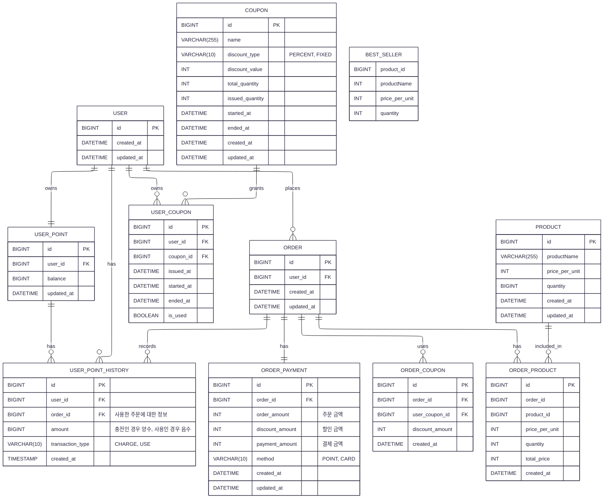

```mermaid
---
config:
  theme: redux
  layout: elk
---
erDiagram
    USER {
        BIGINT id PK
        DATETIME created_at
        DATETIME updated_at
    }
    USER ||--|| USER_POINT : owns
    USER ||--o{ USER_POINT_HISTORY : has
    USER ||--o{ USER_COUPON : owns
    USER ||--o{ ORDER : places   
    USER_POINT {
        BIGINT id PK
        BIGINT user_id FK
        BIGINT balance
        DATETIME updated_at
    }
    USER_POINT ||--o{ USER_POINT_HISTORY : has
    USER_POINT_HISTORY {
        BIGINT id PK
        BIGINT user_id FK
        BIGINT order_id FK  "사용한 주문에 대한 정보"
        BIGINT amount "충전인 경우 양수, 사용인 경우 음수"
        VARCHAR(10) transaction_type "CHARGE, USE"
        TIMESTAMP created_at
    }
    COUPON {
        BIGINT id PK
        VARCHAR(255) name
        VARCHAR(10) discount_type "PERCENT, FIXED"
        INT discount_value
        INT total_quantity
        INT issued_quantity
        DATETIME started_at
        DATETIME ended_at
        DATETIME created_at
        DATETIME updated_at
    }
    COUPON ||--o{ USER_COUPON : grants
    USER_COUPON {
        BIGINT id PK
        BIGINT user_id FK
        BIGINT coupon_id FK
        DATETIME issued_at
        DATETIME started_at
        DATETIME ended_at
        BOOLEAN is_used
    }
    ORDER {
        BIGINT id PK
        BIGINT user_id FK
        DATETIME created_at
        DATETIME updated_at
    }
    ORDER ||--|| ORDER_PAYMENT : has
    ORDER ||--o{ USER_POINT_HISTORY : records
    ORDER ||--o{ ORDER_COUPON : uses
    ORDER ||--o{ ORDER_PRODUCT : has
    ORDER_PAYMENT {
        BIGINT id PK
        BIGINT order_id FK
        INT order_amount "주문 금액"
        INT discount_amount "할인 금액"
        INT payment_amount "결제 금액"
        VARCHAR(10) method "POINT, CARD"
        DATETIME created_at
        DATETIME updated_at
    }
    ORDER_COUPON {
        BIGINT id PK
        BIGINT order_id FK
        BIGINT user_coupon_id FK
        INT discount_amount
        DATETIME created_at
    }
    ORDER_PRODUCT {
        BIGINT id PK
        BIGINT order_id
        BIGINT product_id
        INT price_per_unit
        INT quantity
        INT total_price
        DATETIME created_at
    }
    PRODUCT ||--o{ ORDER_PRODUCT : included_in
    PRODUCT {
        BIGINT id PK
        VARCHAR(255) productName
        INT price_per_unit
        BIGINT quantity
        DATETIME created_at
        DATETIME updated_at
    }

    BEST_SELLER{
        BIGINT product_id
        INT productName
        INT price_per_unit
        INT quantity
    }

```