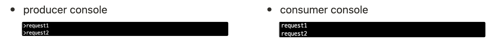

## 카프카 구성 요소
### 1. Producer
- 역할: 메세지를 생성하여 Kafka 클러스트의 특정 토픽에 전송하는 주체
- 특징
  - 토픽을 지정하여 메세지를 전송합니다.
  - 메시지 키에 따라 파티션이 결정됩니다. 

### 2. Broker
- 역할: Kafka 서버 인스턴스로, Producer 가 보낸 메시지를 저장하고 Consumer 에게 전달하는 주체
- 특징
  - 여러개의 Broker가 모여 Kafka 클러스터를 구성하며, 각 Broker는 공유한 ID 를 가집니다.
  - 데이터는 토픽(Topic) -> 파티션(Partition) 구조로 분산 저장합니다.
  - 리더-팔로워 복제 구조로 장애복구를 지원합니다. (리더 장애 시 팔로워가 리더 승격)
  

### 3. Consumer
- 역할: Broker에 저장된 메시지를 구독하여 가져가는 주체
- 특징:
  - Consumer group 단위로 동작하여 하나의 그룹 내에서는 파티션을 나눠서 병렬 처리하게 됩니다.
  - 메시지를 가져간 오프셋 정보를 관리하여 어디까지 읽었는지 추적합니다.

### 4. Topic & Partition
- Topic
  - 메시지를 저장하는 논리적인 단위
  - 예시: `order.created`, `payment.completed`
- Partition
  - 하나의 토픽은 여러 파티션으로 분할 가능합니다.
  - 순서는 파티션 내에서만 보장되며, 파티션 간 전체 순서 보장은 불가능합니다.
  - Consumer Group 규칙: Consumer 수 ≤ Partition 수
    - 파티션보다 Consumer가 많으면 일부 Consumer는 유휴 상태가 되어 리소스를 낭비하게 됩니다.
  - Partition 수와 관련된 고려사항
    - 파티션 수가 많을수록 병렬 처리 성능이 향상됩니다.
    - 그러나 파티션은 늘릴 수는 있어도 줄일 수는 없습니다.따라서 처음에는 보수적으로 설정한 후, 트래픽이 증가할 때 확장하는 전략이 바람직합니다.
    - 파티션 수가 많아지면 리밸런싱 비용(Consumer Group 재분배 시간)이 커지고, 장애 시 리더 선출 지연이 발생할 수 있습니다.
    - 운영 환경에서는 트래픽 규모와 Consumer Group 확장 가능성을 고려하여 결정하며, 일반적으로 초기값은 3개 정도로 시작하는 것이 권장됩니다.
- Offset
  - 파티션 내에서 메시지의 위치를 나타내는 고유한 번호 
  - Consumer는 Offset을 이용하여 메시지를 중복 소비하지 않고 이어서 처리 가능하고,특정 시점으로 되돌아가서 재처리 가능합니다.

## Kafka 로컬 실행 및 테스트

### 1) Docker-compose 설정
`docer-compose.yml`
```
version: '3'
services:
  zookeeper:
    image: confluentinc/cp-zookeeper:7.5.3
    container_name: zookeeper
    environment:
      ZOOKEEPER_CLIENT_PORT: 2181
      ZOOKEEPER_TICK_TIME: 2000
    ports: ["2181:2181"]

  kafka:
    image: confluentinc/cp-kafka:7.5.3
    container_name: kafka
    depends_on: [zookeeper]
    ports: ["9092:9092"]
    environment:
      KAFKA_BROKER_ID: 1
      KAFKA_ZOOKEEPER_CONNECT: zookeeper:2181
      KAFKA_LISTENER_SECURITY_PROTOCOL_MAP: PLAINTEXT:PLAINTEXT,PLAINTEXT_HOST:PLAINTEXT
      KAFKA_LISTENERS: PLAINTEXT://0.0.0.0:29092,PLAINTEXT_HOST://0.0.0.0:9092
      KAFKA_ADVERTISED_LISTENERS: PLAINTEXT://kafka:29092,PLAINTEXT_HOST://localhost:9092
      KAFKA_INTER_BROKER_LISTENER_NAME: PLAINTEXT

      KAFKA_OFFSETS_TOPIC_REPLICATION_FACTOR: 1
      KAFKA_GROUP_INITIAL_REBALANCE_DELAY_MS: 0

networks:
  default:
    driver: bridge
```
- `KAFKA_BROKER_ID` : 브로커가 여러개 있을 경우 각 브로커는 고유한 ID 를 가져야 합니다. 해당 프로젝트에서는 하나의 브로커만 띄웠습니다.
- Zookeeper
  - Kafka 클러스트를 관리하는 별도 코디네이터 서비스
  - 브로커 id, 토픽 메타 데이터, 파티션 리더 정보 등 클러스터 메타 데이터를 관리합니다.
  - Kafka 2.8 이후에는 Zookeeper 없이 동작하는 KRaft 모드도 있습니다.
  - 현재 Docker 환경에서 Kafka를 단일 브로커로만 띄웠지만, 실제 운영을 고려하면 여러 브로커로 확장할 수 있기 때문에 Zookeeper를 통해 확장성과 안정성을 보장하는 구조를 실습 차원에서 구성했습니다.
### 2) 컨테이너 실행
```bash
$ docker-compose up -d
```
실행 후 상태 확인:
```
CONTAINER ID   IMAGE                             COMMAND                  CREATED        STATUS         PORTS                                        NAMES
edabb514a9c5   confluentinc/cp-kafka:7.5.3       "/etc/confluent/dock…"   35 hours ago   Up 9 seconds   0.0.0.0:9092->9092/tcp                       kafka
cb8a2e520c6b   confluentinc/cp-zookeeper:7.5.3   "/etc/confluent/dock…"   35 hours ago   Up 6 hours     2888/tcp, 0.0.0.0:2181->2181/tcp, 3888/tcp   zookeeper
```

### 3) Producer/Consumer 실행 및 테스트
```
//producer 실행
$ docker exec -it kafka kafka-console-producer --topic test-topic --bootstrap-server localhost:9092

//consumer 실행
$ docker exec -it kafka kafka-console-consumer --topic test-topic --from-beginning --bootstrap-server localhost:9092
```

- Producer 에서 보낸 메세지가 Consumer 에서 정상적으로 수신되는 것을 확인했습니다.

