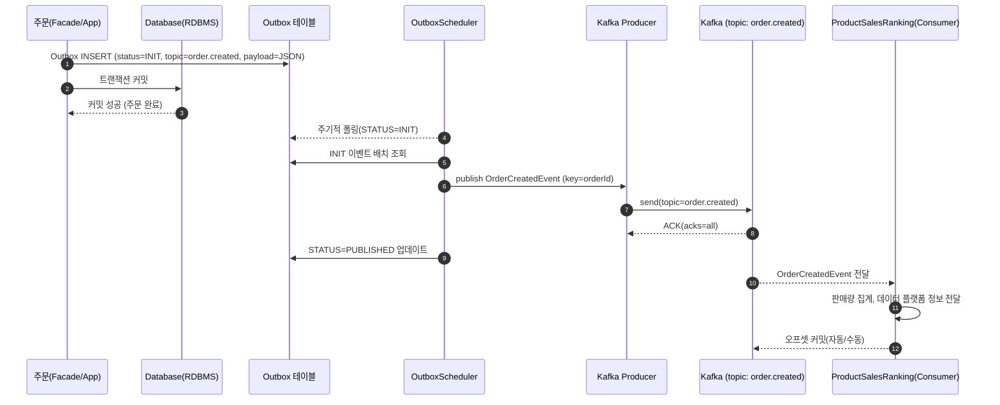

## 주문/결제 완료 이벤트 Kafka 적용 문서

## 1) Kafka 설정

### Producer 설정

```
producer:
    key-serializer: org.apache.kafka.common.serialization.StringSerializer
    value-serializer: org.springframework.kafka.support.serializer.JsonSerializer
    retries: 3
    acks: all
```

- 직렬화(Serialization): 카프카는 바이트 배열로 메시지를 주고받기 때문에 직렬화가 필요합니다.
  - `key: StringSerializer`
    - 파티셔닝/순서 보장을 위해 문자열 키를 사용하였습니다.
  - `value: JsonSerializer`
    - 컨슈머에서 곧바로 역직렬화하기 위해서 이벤트 객체를 JSON으로 발행하였습니다.
- `retries=3`: Broker 일시 장애/네트워크 문제 시 자동 재시도
- `acks=all`: 리더+팔로워 복제까지 확인 후 ACK 를 하여 내구성을 높였습니다.

### Consumer 설정

```
consumer:
    group-id: hhplus-local
    auto-offset-reset: earliest
    enable-auto-commit: true
    auto-commit-interval: 1s
    key-deserializer: org.apache.kafka.common.serialization.StringDeserializer
    value-deserializer: org.springframework.kafka.support.serializer.JsonDeserializer
    properties:
      spring.json.trusted.packages: "kr.hhplus.be.server.**"
```

- `group-id`
  - 컨슈머 그룹 식별자이며 로컬 전용이므로 hhplus-local 으로 설정하였습니다.
- `auto-offset-reset: earliest`
    - 파티션 수를 추가하는 경우 누락이 발생할 수 있기 때문에 가장 이른 오프셋으로 자동 리셋되도록 설정하였습니다.
- `enable-auto-commit=true + auto-commit-interval=1s`
    - 오프셋을 1초 주기로 비동기 커밋 할 수 있도록 설정하였습니다.
- `JsonDeserializer + trusted.packages`
    - 수신 객체(이벤트) 패키지를 화이트리스트로 등록해 역직렬화를 하도록 하였습니다.

## 2) Kafka Producer 클래스
- `OrderEventPublisher` 추상화는 그대로 두고, 구현체만 Kafka 기반으로 변경했습니다.
- 이벤트 클래스와 토픽을 매핑해 발행 시점에 해당 토픽으로 전송하도록 구성했습니다.
```
@Component
@RequiredArgsConstructor
@Slf4j
public class KafkaOrderEventPublisher implements OrderEventPublisher {

    private final KafkaTemplate<String, OrderEvent> kafkaTemplate;

    private static final Map<Class<?>, String> TOPIC_MAP = Map.of(
            OrderCreatedEvent.class, "order.created"
    );

    @Override
    public void publish(OrderEvent event) {
        String topic = TOPIC_MAP.get(event.getClass());
        kafkaTemplate.send(topic, event);
        log.info("Kafka 메시지 전송 완료. topic={}, event={}", topic, event);
    }
}
```

## 3) Kafka Consumer 클래스
- @KafkaListener를 사용해 order.created 토픽을 구독합니다.
- 메시지를 역직렬화해 이벤트 객체로 받은 뒤, 후속 비즈니스 로직(ProductSalesRankingService)을 호출합니다.
- Consumer는 단순히 이벤트 소비자 역할만 수행합니다.

```
@Slf4j
@Component
@RequiredArgsConstructor
public class KafkaOrderEventListener implements OrderEventListener {

    private final ProductSalesRankingService productSalesRankingService;

    @KafkaListener(
            topics = "order.created",
            groupId = "${spring.kafka.consumer.group-id}"
    )
    public void on(OrderCreatedEvent event) {

        log.info("주문 완료 이벤트 리스너 성공");
        log.info("[DataPlatformEventHandler] thread={} id={}",
                Thread.currentThread().getName(), Thread.currentThread().getId());

        log.info("[ProductSalesRankingEventHandler] thread={} id={}",
                Thread.currentThread().getName(), Thread.currentThread().getId());

        productSalesRankingService.increaseQuantity(
                event.orderedAt(),
                event.products().stream()
                        .map(product -> new SalesProductCommand(product.productId(), product.quantity()))
                        .toList()
        );
    }
}
```

## 4) Outbox Pattern 적용

### 배경
- 기존에는 도메인 내부에서 이벤트를 발행할 때 @TransactionalEventListener를 사용했습니다. 이를 통해 
DB 트랜잭션이 커밋된 뒤에 이벤트가 발행되므로 데이터 일관성은 보장할 수 있었습니다.
- 하지만, Application 이벤트 적용을 Kafka 이벤트로 변경하면서 다음과 같은 문제 가능성이 있었습니다.
  - 트랜잭션이 실패하면 데이터는 롤백되지만, 이미 발행된 이벤트는 그대로 남아 있어서 데이터 정합성 문제 가능성
  - 트랜잭션이 성공했더라도 Kafka 장애나 네트워크 문제로 인한 메세지 전송이 실패하면 원자성이 깨질 가능성이 있다.
- 물론, Application 이벤트 발행을 사용하여서 @TransactionalEventListener(after_commit) 커밋 이후 kafka 이벤트를 발행할 수 있었으나,
도메인 이벤트를 사용하면 변경의 관리와 추적이 매우 어렵다는 점으로 단일 서비스에서 사용을 지양하도록 하였습니다.
- 따라서 데이터베이스의 트랜잭션과 메세지 브로커를 통해 데이터의 일관성과 메세지 전송의 원자성을 보장하는 `Outbox Pattern` 을 적용하기로 하였습니다.


### 데이터 모델
```
@Entity
@NoArgsConstructor(access = AccessLevel.PROTECTED)
@AllArgsConstructor
@Builder
@Getter
public class OutboxEvent {

    @Id
    @GeneratedValue(strategy = GenerationType.IDENTITY)
    private long id;

    private String aggregateType;

    private long aggregateId;

    private String topic;

    private String payload;

    @Enumerated(EnumType.STRING)
    private OutboxStatus status;

    private LocalDateTime createdAt;

    public static OutboxEvent create(String aggregateType, long aggregateId, String topic, String payload){
        return OutboxEvent.builder()
                .aggregateType(aggregateType)
                .aggregateId(aggregateId)
                .topic(topic)
                .payload(payload)
                .status(OutboxStatus.INIT)
                .createdAt(LocalDateTime.now())
                .build();
    }

    public void markPublished() {
        this.status = OutboxStatus.PUBLISHED;
    }

    public void markFailed(){
        this.status = OutboxStatus.FAILED;
    }
}
```
- id: 멱등/추적용 Outbox 이벤트 ID
- aggregate_type: 도메인 타입(예: order)
- aggregate_id: 도메인 ID(예: order_id)
- topic: 이벤트 토픽(예: order.created)
- payload: JSON 텍스트
- status: INIT → PUBLISHED/FAILED

### 흐름


#### 1. 도메인 트랜잭션
- 주문/결제 로직 실행
- 같은 트랜잭션 안에서 Outbox 테이블에 이벤트를 INIT 상태로 INSERT
- DB 커밋 성공 시 Outbox 레코드 확정

#### 2. 스케줄러
- 주기적으로 status=INIT 이벤트를 조회
- payload 역직렬화 후 OrderEventPublisher.publish() 호출
- 발행 성공 → PUBLISHED, 실패 → FAILED로 상태 변경
```
@Component
@RequiredArgsConstructor
@Slf4j
public class OrderOutboxScheduler {
    private final OutboxEventService outboxEventService;
    private final OrderEventPublisher orderEventPublisher;
    private final ObjectMapper objectMapper;

    @Transactional
    @Scheduled(fixedDelay = 1000)
    public void runOrderCreated() {
        List<OutboxEvent> batch = outboxEventService.findInitByTopic("order.created");

        for (OutboxEvent row : batch) {
            try {
                OrderCreatedEvent event = objectMapper.readValue(row.getPayload(), OrderCreatedEvent.class);

                orderEventPublisher.publish(event);

                outboxEventService.markPublished(row);

                log.info("[OUTBOX] published topic={} key={} outboxId={}",
                        row.getTopic(), row.getAggregateId(), row.getId());

            } catch (Exception ex) {
                outboxEventService.markFailed(row);

                log.error("[OUTBOX] publish failed topic={} key={} outboxId={} err={}",
                        row.getTopic(), row.getAggregateId(), row.getId(), ex.toString());

            }
        }
    }
}
```