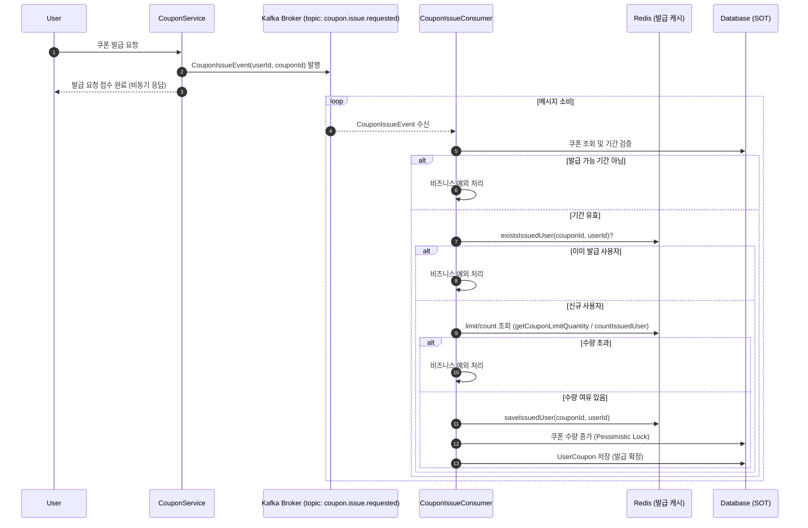

## 선착순 쿠폰 발급 Kafka 적용 문서


- Kafka: 발급 요청을 이벤트로 비동기 처리하여 API 응답 속도를 빠르게 하고, 파티션을 통해 쿠폰별 순서를 보장.
- Redis: 빠른 중복 발급 차단 및 발급 수량 체크.
- DB: 트랜잭션 내 최종 발급 수량 증가 및 user_coupon 저장으로 정합성 보장.

## 이벤트 발행
```
@Component
@RequiredArgsConstructor
@Slf4j
public class KafkaCouponEventPublisher implements CouponEventPublisher {

    private final KafkaTemplate<String, CouponEvent> kafkaTemplate;

    @Override
    public void publish(CouponEvent event) {
        if (event instanceof CouponIssueEvent e) {
            String key = String.valueOf(e.couponId()); // 파티션 키
            kafkaTemplate.send("coupon.issue", key, event);
            log.info("Kafka 메시지 전송 완료. topic={}, key={}, event={}", "coupon.issue", key, event);
        }
    }
}
```
- 토픽 이름: coupon.issue
- 메시지 Key: couponId (동일 쿠폰은 같은 파티션에 들어가 순서 보장)
- Value: CouponIssueEvent(userId, couponId)

## 이벤트 처리
```
@Component
@RequiredArgsConstructor
@Slf4j
public class KafkaCouponEventListener implements CouponEventListener {

    private final CouponService couponService;

    @KafkaListener(
            topics = "coupon.issue",
            groupId = "${spring.kafka.consumer.group-id}",
            concurrency = "3"
    )
    public void on(CouponIssueEvent event) {
        try {
            couponService.handleCouponIssue(event.userId(), event.couponId());
            log.info("선착순 쿠폰 성공");
        } catch (Exception e) {
            log.error("쿠폰 발급 실패", e);
        }
    }
}

```
- 컨슈머 그룹: ${spring.kafka.consumer.group-id}
- 동시성(concurrency): 3 (파티션 수에 맞게 설정)
- 이벤트 수신 후 CouponService.handleCouponIssue() 호출

## 쿠폰 발급
```
@Transactional
public void handleCouponIssue(long userId, long couponId) {
    Coupon coupon = getCoupon(couponId);
    coupon.validateIssuePeriod(); // 발급 기간 확인

    // Redis: 중복 발급 차단
    if (couponIssueCacheRepository.existsIssuedUser(couponId, userId)) {
        throw new BusinessException(ErrorCode.ALREADY_ISSUED_COUPON);
    }

    // Redis: 수량 체크
    int limitQuantity = couponIssueCacheRepository.getCouponLimitQuantity(couponId);
    long issuedCount = couponIssueCacheRepository.countIssuedUser(couponId);
    if (limitQuantity <= issuedCount) {
        throw new BusinessException(ErrorCode.EXCEED_QUANTITY);
    }

    // Redis: 발급 유저 등록
    couponIssueCacheRepository.saveIssuedUser(couponId, userId);

    // DB: 수량 증가 + 발급 기록 저장
    CouponQuantity couponQuantity = couponQuantityRepository.findWithPessimisticLock(couponId);
    couponQuantity.increaseIssuedQuantity();
    userCouponRepository.save(UserCoupon.create(userId, couponId, coupon.getIssuedEndedAt()));
}
```
- 쿠폰 유효성 검증: 발급 기간 내인지 확인
- Redis Set: 이미 발급된 유저인지 확인 (SISMEMBER)
- Redis Counter: 발급된 수량 확인 → 초과 시 예외
- Redis 저장: 발급 유저 추가
- DB 트랜잭션
- coupon_quantity 레코드를 비관적 락으로 가져와 수량 증가
- user_coupon 테이블에 발급 기록 저장