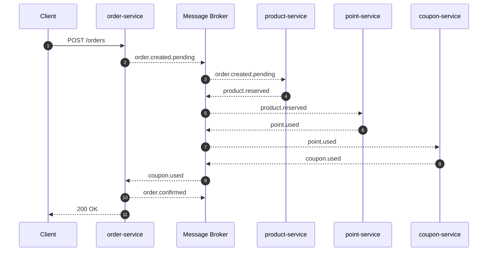
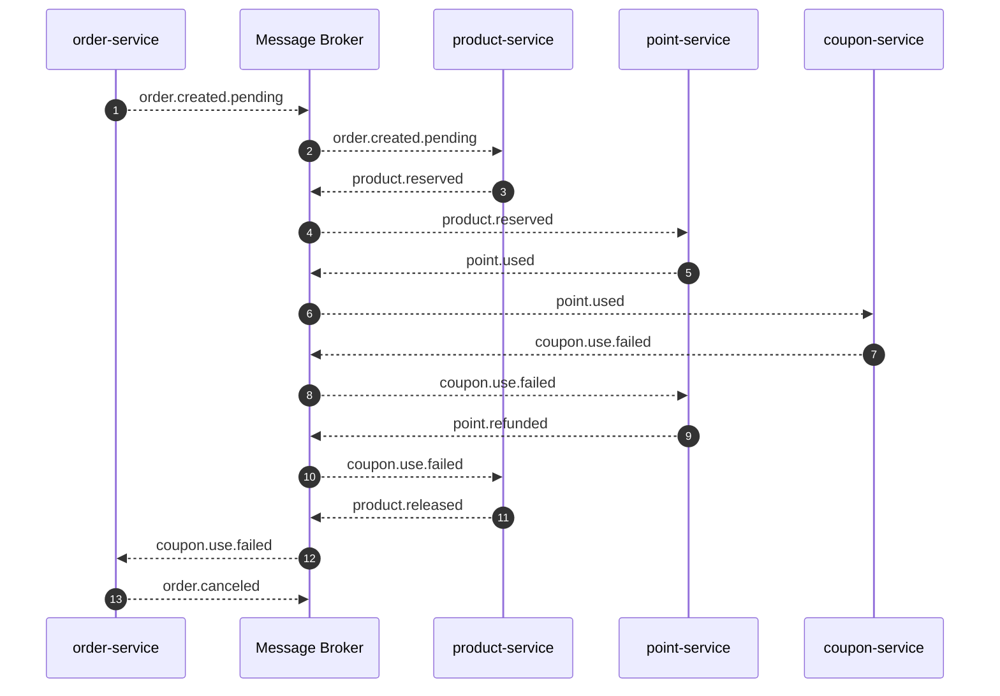

## 0. 목표
- 현재 단일 어플리케이션의 `OrderFacade.place()` 는 하나의 DB 트랜잭션 경계 내에서 **1) 주문 생성, 2) 상품 수량 차감, 3) 포인트 사용, 4) 쿠폰 사용**을 처리하고 있습니다.
- 그러나 **서비스 확장에 따라 어플리케이션 서버와 DB를 도메인별로 분리(MSA 적용)** 하면, 단일 DB 트랜잭션 유지가 불가능합니다.
- 이에 따라 **분산 트랜잭션 전략**이 필요하며, Saga 패턴(Choreography)과 **보상 트랜잭션**을 통해 **최종 일관성과 멱등성 보장**을 목표로 합니다.

## 1. 개요
### 현재 플로우(단일 어플리케이션)
```
OrderFacade.place()

OrderService.create()      //(1) 주문 생성
-> Product.decreaseQuantity() //(2) 상품 수량 차감
-> Point.use()             //(3) 포인트 사용
-> Coupon.use()            //(4) 쿠폰 사용
```
- Product/Point: 비관적 락
- Coupon: 낙관적 락
- Order: 멀티 분산락(ProductId + UserId)

### 문제
- 서비스/DB 분리 시 단일 트랜잭션 불가 → 부분 실패 발생이 필요하므로 **보상 트랜잭션** 필요

### 목표 아키텍처
- 서비스 단위 분리: `order-service`, `product-service`, `point-service`, `coupon-service`
- **동기 처리**: 주문 핵심 플로우(재고 차감, 포인트 사용, 쿠폰 사용)
- **비동기 처리**: 데이터 플랫폼 전송, 인기 상품 랭킹 업데이트

## 2. 대응 방안
### Saga 패턴 채택
- Saga 패턴은 서비스 간의 로컬 트랜잭션을 이벤트로 연결하여 전체 트랜잭션을 완성하는 방식입니다.
하나의 단계가 실패하면, 이전 단계에서 발행한 이벤트를 보상(Compensation) 이벤트로 되돌려 보상 트랜잭션을 실행하여 최종 일관성을 유지합니다.
- 현재 프로젝트는 서비스 수가 많지 않으므로 `Choreography Saga` 패턴을 채택하였습니다.
  - 각 마이크로서비스가 이벤트 구독/발행으로 상태 전이를 직접 수행하는 방식입니다.
  - 단점은 서비스가 많아질수록 이벤트 흐름 파악 어려우며, 순환 의존성 발생 가능합니다.
- 반면, Orchestrator Saga는 중앙 오케스트레이터가 전체 이벤트 흐름을 제어하는 방식입니다.
  - 장점: 트랜잭션 플로우의 가시성을 높이고 순환 의존을 방지할 수 있습니다.
  - 단점: 단일 장애 지점(SPOF)이 될 수 있으며, 추가적인 인프라 구성이 필요합니다.

#### Saga 패턴 시퀀스 다이어그램


### 보상 트랜잭션 설계

- Product 실패 → Order CANCELED
- Point 실패 → Product release + Order CANCELED
- Coupon 실패 → Point refund + Product release + Order CANCELED


## 결론
- **Choreography Saga**로 서비스 간 분산 트랜잭션 처리
- **보상 트랜잭션**으로 부분 실패 복구