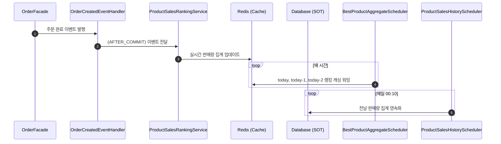

## 실시간 인기 상품 조회
### 1. 시나리오 흐름
1. 주문 완료 시 이벤트 발행
    - 주문이 완료되면 OrderFacade 에서 OrderCreatedEvent 를 발행합니다.
2. 메인 트랜잭션 커밋 이후 실시간 판매량 집계
    - 이벤트 리스너(OrderCreatedEventHandler)가 AFTER_COMMIT 단계에서 호출되어 트랜잭션의 일관성을 보장합니다.
    - ProductSalesRankingService 에서 Redis Sorted Set 을 사용해 실시간으로 판매량을 증가시킵니다.
3. 한 시간에 한 번, 스케줄러에 의한 캐싱 워밍
    - BestProductAggregateScheduler 가 실행되어 최근 3일(today, today-1, today-2)의 판매 데이터를 합산합니다.
    - Redis의 ZUNIONSTORE 명령어를 통해 집계된 랭킹을 캐싱하여 조회 성능을 최적화합니다.
4. 하루에 한 번, 스케줄러에 의한 DB 영속화
    - ProductSalesHistoryScheduler 가 매일 00:10에 실행됩니다.
    - Redis에 집계된 전날 판매 데이터를 SOT(Source of Truth)인 DB에 영속화하여 데이터 유실을 방지합니다.

### 2. 시퀀스 다이어그램

### 3. Redis 자료 구조 설계
#### 선택한 자료구조: Sorted Set (ZSET)
#### 이유
- member(상품 ID)에 대해 score(판매량)를 기반으로 자동 정렬이 가능
- 범위 기반 조회(ZRANGE, ZREVRANGE) 지원
#### Key 설계
- 일 단위 집계
    - Key: `product:ranking:day:{YYYY-MM-DD}`
    - Member: `productId`
    - Score: `quantity`
- 3일간 집계
    - `ZUNIONSTORE product:ranking:3days product:ranking:day:today product:ranking:day:today-1 product:ranking:day:today-2`
    - 최근 3일간 집계 데이터를 캐싱해두어 실시간 조회 성능을 보장

### 4. 장점 및 고려사항

#### 장점
- 이벤트 기반 비동기 처리: 주문 트랜잭션과 분리되어 메인 로직 성능 저하 최소화
- Redis 활용한 고성능 집계: Sorted Set 사용으로 랭킹 연산 최적화
- 스케줄러 기반 캐싱 & 영속화: 캐싱 워밍으로 조회 지연 방지, DB 영속화로 데이터 유실 방지

#### 고려사항
- 3일 단위 vs 72시간 단위 집계
    - 단순 3일 단위(today, today-1, today-2)는 구현이 간단
    - 정확한 "72시간 기준 집계"를 위해서는 Lua Script + Sliding Window 방식 고려 필요
- DB 영속화 시 부하
    - 하루 단위 batch insert 시 부하 고려 필요