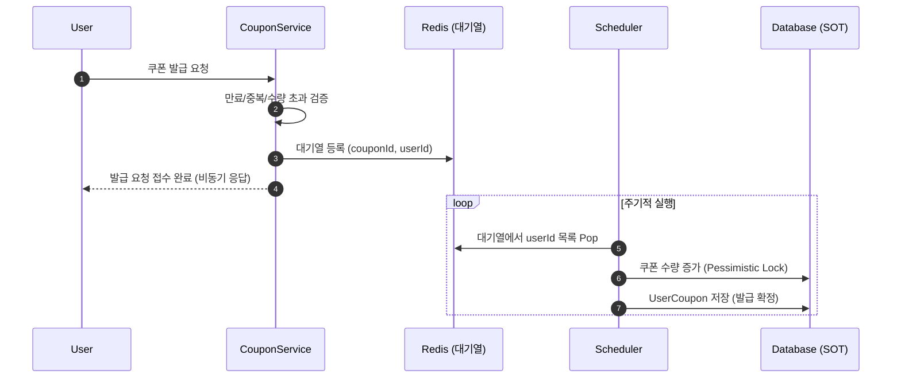

## 선착순 쿠폰 발급
### 1. 시나리오 흐름
1. 사용자가 쿠폰 발급 요청을 하면, 쿠폰 발급 가능 여부(만료, 중복, 수량 초과) 를 동기적으로 검증한다.
    - 만료 여부 → 쿠폰 메타데이터 확인
    - 중복 여부 → Redis Set(coupon:issue:{couponId}) 확인
    - 수량 초과 여부 → Redis Set 사이즈 확인
2. 검증을 통과하면, 실제 발급은 비동기적으로 처리한다.
    - 요청은 Redis 대기열(List)에 userId 를 등록하고,
    - 해당 쿠폰 ID 는 PENDING_COUPON_KEY(Set)에 넣어 스케줄러가 어떤 쿠폰을 처리할지 알 수 있도록 한다.
3. 스케줄러가 주기적으로 실행되어
    - PENDING_COUPON_KEY에서 대기 중인 쿠폰 ID들을 조회한다.
    - 각 쿠폰 ID에 대해 coupon:queue:{couponId} 큐에서 userId 들을 batchSize 만큼 꺼낸다.
    - 발급 처리(DB 반영) 후, 큐가 완전히 비었다면 PENDING_COUPON_KEY에서 해당 쿠폰 ID를 제거한다.

### 2. 시퀀스 다이어그램

## 3. Redis 자료구조 설계
#### 선택한 자료구조
- Set(userId) : 이미 발급된 사용자 체크 / 수량 체크
    - Key: `coupon:issued:{couponId}`
    - Value: userId
- List(userId) : 발급 대기열 관리
    - Key: `coupon:queue:{couponId}`
    - Value: userId
    - LPUSH + RPOP → FIFO 구조 보장
- Set(couponId) : 대기중 쿠폰 ID 관리
    - Key: `coupon:pending`
    - Value: couponId

## 4. 장점 및 고려사항

#### 장점
- 동기 검증 → 비동기 발급 구조로 DB 부하 최소화
- Redis 자료구조 활용으로 중복 방지 및 선착순 보장
- 스케줄러를 통한 배치 처리로 대량 발급 상황에도 안정적 운영

#### 고려사항
- 스케줄러 주기
    - 너무 짧으면 DB 부하가 집중될 수 있음
    - 너무 길면 사용자 입장에서 발급 확정이 늦어짐