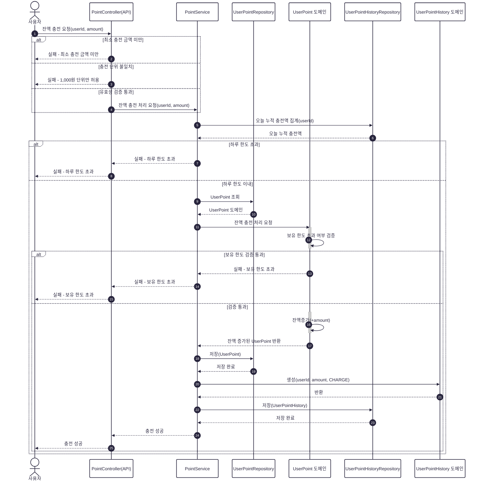
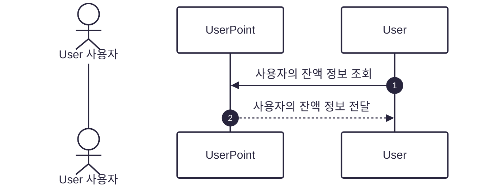
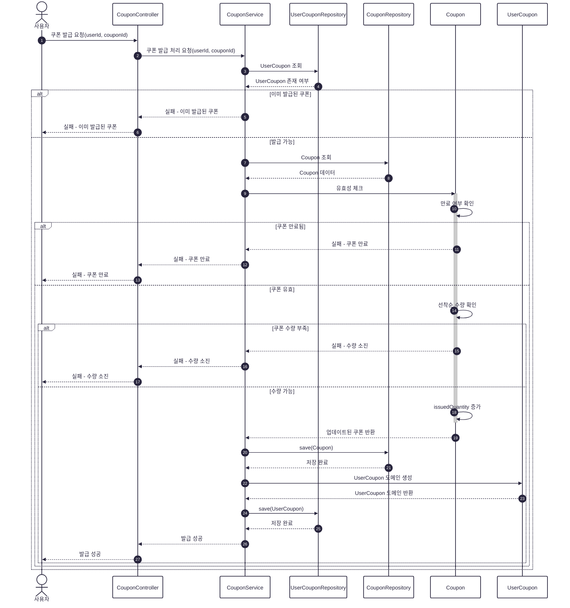
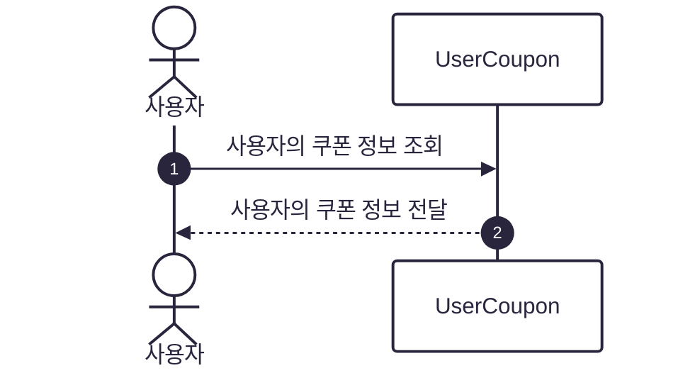
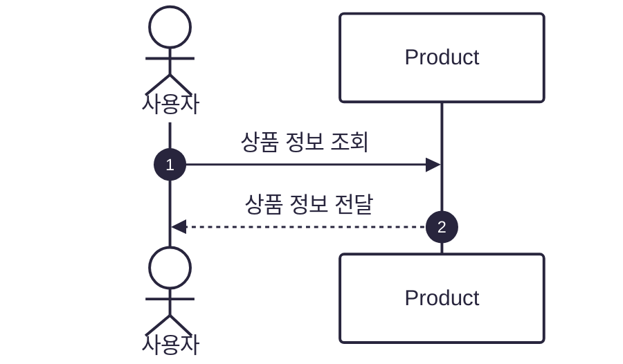
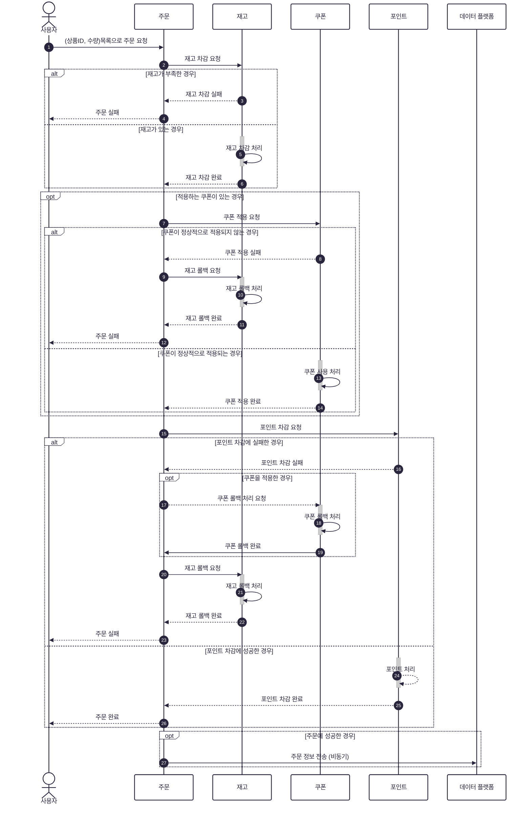
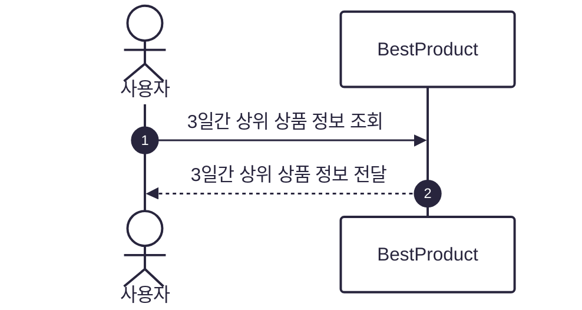
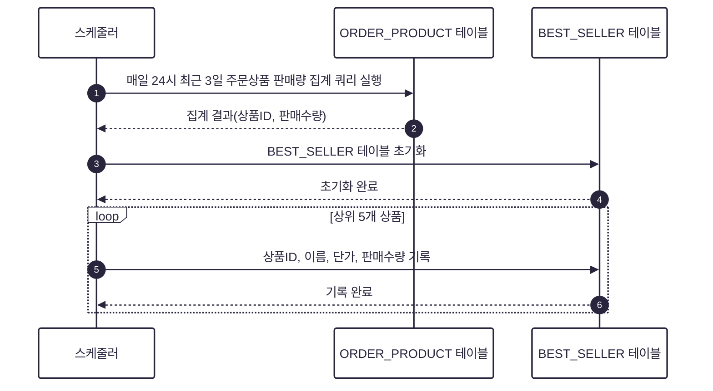

## 1. 포인트
### 포인트 충전 시퀀스 다이어그램

### 포인트 조회 시퀀스 다이어그램

## 2. 쿠폰
### 선착순 쿠폰 발급 시퀀스 다이어그램

### 보유 쿠폰 조회 시퀀스 다이어그램

## 3. 쿠폰
### 상품 조회 시퀀스 다이어그램

## 4. 주문/결제
### 주문/결제 시퀀스 다이어그램

## 5. 상위 상품
### 상위 상품 조회 시퀀스 다이어그램

### 상위 상품 스케줄러 시퀀스 다이어그램
